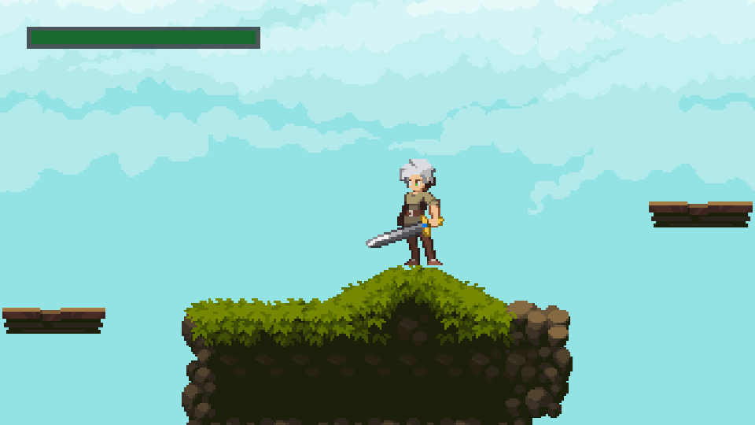

# framework2D

A cross-platform 2D game engine built with C++17, designed for creating 2D games with multiple rendering backends and a structured state machine architecture.

## Example Game: FantasySideScroller

The `bin/fantasySideScroller` directory contains a side-scroller demo
showcasing the engine capabilities.

### Screenshot

## Assets

The `/bin/fantasySideScroller` folder contains free-to-use assets from anokolisa.itch.io and others.

## Features

- **Multi-API Rendering**: DirectX 9, Vulkan, OpenGL, and Metal (macOS/iOS)
- **State Machine Architecture**: Easy game state transitions (hub, mini-games, menus)
- **Tile Map Support**: Level editing with Tiled Map Editor (.tmj, .tmx)
- **Animation System**: Sprite-based animations with frame interpolation
- **Collision System**: AABB-based collision detection and physics operators
- **Event-Driven Input**: Keyboard, mouse, and gamepad input handling
- **JSON Data-Driven**: Configuration via JSON for currencies, upgrades, and content

## Build Dependencies

- **DirectX 9 SDK** (June 2010) - Windows only
- **Vulkan SDK**
- **GLM** (math library)
- **GLFW3** (windowing/input)
- **TinyXML2** (parsing)
- **SIMDJSON** (JSON processing)
- **stb** suite (image loading)
- **FastDelegate** (function objects)
- **Visual Leak Detector** (optional, env vars: VLD_INCLUDE, VLD_LIB)

## Project Structure

- **src/** - Engine source (GameState, Game, Engine2D, etc.)
- **framework/** - Framework project (main engine build)
- **bin/** - Built executables
- **fantasySideScroller/** - Example game demonstrating the engine
- **ext/** - External libraries (stb, delegate, glm, etc.)
- **doc/** - Design documents (Fractured Earth)
- **tools/** - Migration/analysis scripts
- **utl/** - Utility tools
- **CMakeLists.txt** - CMake build configuration

## Building

This project uses CMake. On Windows, Visual Studio projects are available
via the .sln and .vcxproj files. 

On macOS, you can build just by running 'make'.

## Support

If you reuse any of this code, please give a shout out or buy me a coffee for support. <3

## Contact

Contact: stan.taveras@gmail.com

