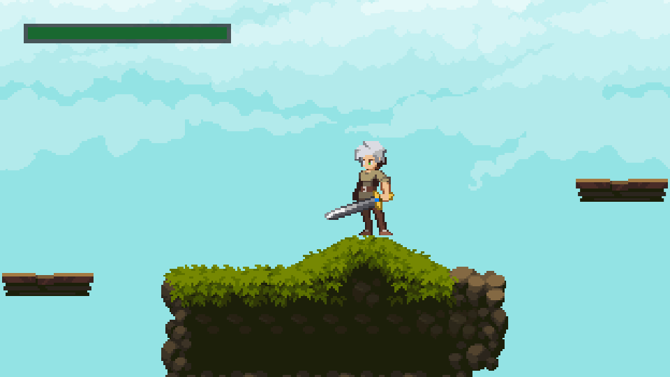

# framework2D

A cross-platform 2D game engine built with C++17, designed for creating 2D games with multiple rendering backends and a structured state machine architecture.

## Example Game: FantasySideScroller

The `bin/fantasySideScroller` directory contains a side-scroller demo
showcasing the engine capabilities.

### Screenshot



## Assets

The `/bin/fantasySideScroller` folder contains free-to-use assets from anokolisa.itch.io and others.

## Features

- **Multi-API Rendering**: DirectX 9, Vulkan, OpenGL, and Metal (macOS/iOS)
- **State Machine Architecture**: Easy game state transitions (hub, mini-games, menus)
- **Tile Map Support**: Level editing with Tiled Map Editor (.tmj, .tmx)
- **Animation System**: Sprite-based animations with frame interpolation
- **Collision System**: AABB-based collision detection and physics operators
- **Event-Driven Input**: Keyboard, mouse, and mapped gamepad input handling
- **JSON Data-Driven**: Configuration via JSON for currencies, upgrades, and content

## Build Dependencies

- **DirectX 9 SDK** (June 2010) - Windows only
- **Vulkan SDK**
- **GLM** (math library)
- **GLFW 3.3+** (windowing/input and standardized gamepad mappings)
- **TinyXML2** (parsing)
- **SIMDJSON** (JSON processing)
- **stb** suite (image loading)
- **FastDelegate** (function objects)
- **Visual Leak Detector** (optional, env vars: VLD_INCLUDE, VLD_LIB)

## Project Structure

- **src/** - Engine source (GameState, Game, Engine2D, etc.)
- **framework/** - Framework project (main engine build)
- **bin/** - Built executables
- **fantasySideScroller/** - Example game demonstrating the engine
- **ext/** - External libraries (stb, delegate, glm, etc.)
- **doc/** - Design documents (Fractured Earth)
- **tools/** - Migration/analysis scripts
- **utl/** - Utility tools
- **CMakeLists.txt** - CMake build configuration

## Building

This project uses CMake. On Windows, Visual Studio projects are available
via the .sln and .vcxproj files. 

On macOS, you can build just by running 'make'.

## Gamepad input

GLFW-mapped gamepads are available through `Engine2D::getInput()->getGamepad()`.
Button names use the standard layout (`A`, `B`, `X`, `Y`, bumpers, and D-pad),
and the API also exposes the left and right sticks and triggers. Stick values
range from -1 to 1; trigger values range from 0 to 1. `Action` can bind keyboard
keys, gamepad buttons, and signed axis thresholds, so one action can accept
multiple input devices. The FantasySideScroller sample uses the left stick or
D-pad to move, A (DualShock 4 Cross) to jump, X (Square) to attack, and the left
bumper to run.
Escape and the DualShock 4 Options button share the `PAUSE` action to pause and resume.

With `--debug` enabled, press F5 during gameplay to reload the current stage
and its tileset definitions from disk. This resets enemies, props, traversal
progress, and the player's state, but keeps the player at their current
position. Press Shift+F5 to reload and respawn the player at the map-authored
spawn point instead. Holding either combination reloads only once.

## Support

If you reuse any of this code, please give a shout out or buy me a coffee for support. <3

## Contact

Contact: stan.taveras@gmail.com

## Boar enemy

A boar spawns to the right of the entrance in Mosswood Hollow. It idles for two
seconds, patrols until a ledge or wall, waits two seconds, turns around, then
waits another two seconds before moving. When a player is in front, it charges
and stops just short of the character, then holds position while attacking.
A player detection interrupts a regular patrol idle after a 0.25-second
reaction; the boar finishes any pending wall turn first.
Each attack deals 10 health
once per second, so ten hits from full health are fatal. The first frame of the
Hit-Vanish sheet is used as its one-shot attack pose; it takes two sword slashes
to defeat the boar. Press R to reset the player and all boars.

Run `make test-boar` for headless asset, movement, combat, respawn, and map
collision checks. Build the game with `make`.

## Performance

Boar support probes, character ground probes, and collision resolution now use
the framework's shared spatial queries. Static collider bounds are indexed once
and refreshed after edits; ordinary ticks update only dynamic objects. Queries
preserve candidate ordering and leave exact collision and support rules intact.

Latest local Windows x64 Debug/DirectX measurements (September 20, 2026), with
VLD disabled in **both** builds, profiling enabled, VSync/overlays off, and a
five-second idle sample after warm-up:

| Metric | Before spatial queries | After spatial queries |
| --- | ---: | ---: |
| Game update per tick | 15.29 ms | 1.21 ms |
| Collision processing per tick | 8.05 ms | 0.59 ms |
| Average FPS | 54.2 | 258.5 |
| p95 frame time | 24.82 ms | 4.80 ms |
| Collision candidate checks per tick | 2,483 | 13.7 |

The scene contains 5,752 objects. Boar and character support queries formerly
visited all of them; the measured indexed queries returned about 3 and 6
candidates respectively. The final measured run rebuilt the static index zero
times. These are local variable-step idle measurements, not a cycle-identical
replay or a frame-rate guarantee for every scene.

Set `AUTO_PROFILE=1` to print inclusive region times and candidate counts on exit.
With pacing active it also prints a `PACING` line: input-sample-to-vblank latency
(mean/p95/p99), the average pre-input wait, and missed vblanks.

### Late input sampling and render interpolation

With `--vsync`, the loop no longer polls input straight after the swap. It
sleeps until the predicted next vblank minus the recent worst update+render
time (plus a margin), then polls input, updates and renders, so the frame
that scans out carries input that is a few milliseconds old rather than a
whole refresh old. On OpenGL the renderer also finishes GPU work before the
swap while pacing, so that GPU time counts towards the measured work. If a
vblank is missed the margin grows and then decays; the budget never exceeds
one refresh, so the worst case matches the unpaced loop.

| Variable | Effect |
| --- | --- |
| `AUTO_INPUT_PACING` | `0` disables pacing, `1` forces it on without VSync (default: on with VSync) |
| `AUTO_INPUT_PACING_MARGIN_MS` | Safety margin on top of the measured work time (default 2) |
| `AUTO_REFRESH_HZ` | Override the refresh rate read from the monitor |
| `AUTO_SIMULATE_VSYNC` | Present to a virtual display that blocks until its next vblank, for A/B measurements where the driver has no real VSync (e.g. Xvfb) |
| `AUTO_RENDER_INTERPOLATION` | `0` disables deterministic-mode interpolation (default on) |
| `AUTO_RENDER_INTERPOLATION_SNAP` | Moves longer than this per tick are drawn as teleports (default 128) |

In deterministic mode, world-space renderables and the camera are drawn
between the last two ticks using the leftover accumulator fraction, then put
back, so game code only sees simulation positions. This removes the judder of
a tick rate that does not divide the refresh rate, at the cost of drawing up
to one tick behind the newest simulated state.

Local Linux measurement (Xvfb + Mesa llvmpipe, `AUTO_SIMULATE_VSYNC=1` at 60 Hz,
idle scene, four alternating ten-second runs each):

| | Input-to-vblank mean | p95 | p99 | Missed vblanks |
| --- | ---: | ---: | ---: | ---: |
| Pacing off | 16.70 ms | 16.65 ms | 16.65 ms | 0 |
| Pacing on | 12.97 ms | 15.81 ms | 15.82 ms | 2–6 per ~595 frames |

That machine renders in software on four shared cores, so its work time is
long (~8 ms) and noisy; a real GPU leaves more of the refresh for the wait.
See [spatial-query architecture, mutation rules, and tests](doc/spatial_queries.md)
for the API contract and commands. All three headless regression suites pass,
including reference-solver comparisons and real-map boar/support checks.

`make` builds with `-O2`; `make DEBUG=1` keeps an unoptimized debug build.
Release and debug objects are stored separately. Use the release executable
for frame-rate measurements.

Run `tools/benchmark.sh --opengl` for a ten-second benchmark after a one-second
warm-up. It exits automatically and reports average FPS, mean/p95/p99 frame
times, and frames exceeding the 16.67 ms budget for 60 FPS. Set
`AUTO_BENCHMARK_SECONDS` to change the measurement duration. Add `--vsync` to
measure presentation pacing; leave it off to measure rendering throughput.
Existing input replays can be used through `AUTO_INPUT_REPLAY_PATH` for a
repeatable moving-camera workload. Keep window size, replay, and debug-overlay
settings identical when comparing runs.

On Windows, normal Debug builds exclude Visual Leak Detector, even when it is
installed. Previously, finding `vld.h` automatically loaded it, and allocation
tracing stayed enabled unless `--debug` was passed. Its stack tracing can dominate
frame time. Debug symbols, assertions, and unoptimized application code remain
enabled in the normal Debug configuration.

For leak investigation, build with `msbuild framework.vcxproj
/p:Configuration="Debug (DX)" /p:Platform=x64 /p:FrameworkEnableVLD=true`, or
configure CMake with `-DFRAMEWORK_ENABLE_VLD=ON`. Set `VLD_INCLUDE` to the VLD
include directory and `VLD_LIB` to its lib directory. Then set
`AUTO_MEMORY_DEBUG=1` when launching to enable tracing across all threads.
Rebuild with the option off when returning to normal debugging.

To benchmark an existing Windows Debug executable from the repository root:

```powershell
$env:AUTO_BENCHMARK_SECONDS = '10'
try {
    & .\bin\framework2D_d.exe --dataPath .\bin\fantasySideScroller
} finally {
    Remove-Item Env:AUTO_BENCHMARK_SECONDS
}
```

The benchmark excludes the first update (which can load the level), then warms
up for one second. Local Windows x64 Debug/DirectX measurements on September 19,
2026, with a five-second idle sample and VSync/overlays off:

| Configuration | Average FPS | Mean frame time | p95 frame time |
| --- | ---: | ---: | ---: |
| VLD included, allocation tracing enabled | 5.0 | 200.85 ms | 211.66 ms |
| Normal Debug, VLD excluded | 35.7 | 28.01 ms | 34.57 ms |

This removes a major diagnostic overhead, but does not make unoptimized Debug
a locked 60 FPS build. Temporary timing instrumentation also identified game
updates as the remaining dominant cost; rendering was roughly 3–4 ms per frame.

The OpenGL renderer culls sprites outside the camera bounds and batches
consecutive sprites sharing a texture, preserving transparency/layer order.

Local macOS/OpenGL measurements (640×480 logical window, September 15, 2026):

| Workload | Average FPS | p95 frame time | p99 frame time |
| --- | ---: | ---: | ---: |
| Previous build, idle | 30.7 | 49.49 ms | 62.69 ms |
| Optimized build, idle | 134.9 | 15.37 ms | 16.87 ms |
| Optimized, deterministic flat-jump replay | 144.7 | 18.27 ms | 28.36 ms |
| Optimized, VSync enabled | 102.3 | 16.85 ms | 20.25 ms |

These runs exceed 60 FPS on average; occasional frames still exceed 16.67 ms,
particularly during replay. This is not a guarantee of a locked 60 FPS on every
machine. VSync follows the display's refresh rate, which need not be 60 Hz.
The boar/terrain behavior checks passed with assertions enabled. A framebuffer
comparison against the previous renderer covered 12 combinations of camera
anchor, rotation, and zoom with overlapping translucent, flipped sprites:
0–4 differing color channels out of 1,228,800 per case (tolerance: 2/255),
with no OpenGL errors.
